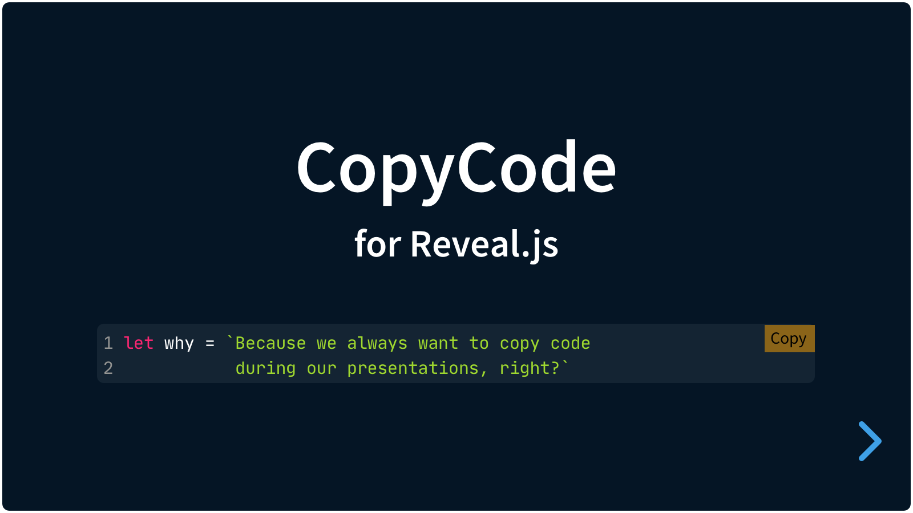

# CopyCode

[](#) [](#) [](https://github.com/Martinomagnifico/reveal.js-copycode/archive/refs/heads/master.zip)

A simple plugin for [Reveal.js](https://revealjs.com) 4 that automatically shows a 'copy' button in code blocks.

[](https://martinomagnifico.github.io/reveal.js-copycode/demo.html)

In Reveal.js presentations we can show blocks of code. This plugin for Reveal.js adds a 'copy' button to each of those. 

[Demo](https://martinomagnifico.github.io/reveal.js-copycode/demo.html)

It's easy to set up. If your code blocks are set up like this:

```html
<pre>
  <code>
    Here is the code
  </code>
</pre>
```

then install the plugin and it will work automatically.


## Installation

The CopyCode plugin has been rewritten for Reveal.js version 4.

If you want to use CopyCode with an older version of Reveal, use the [1.0.0 version](https://github.com/Martinomagnifico/reveal.js-copycode/releases).

### Regular installation

Copy the copycode folder to the plugins folder of the reveal.js folder, like this: `plugin/copycode`.


### npm installation

This plugin is published to, and can be installed from, npm.

```javascript
npm install reveal.js-copycode
```
The CopyCode plugin folder can then be referenced from `node_modules/reveal.js-copycode/plugin/copycode`


## Setup

### JavaScript


CopyCode needs one other (great) script to be able to function: [Clipboard.js](https://clipboardjs.com/) by [Zeno Rocha](https://zenorocha.com). This uses modern techniques to copy text to clipboard.

```html
<script src="dist/reveal.js">
<script src="https://cdnjs.cloudflare.com/ajax/libs/clipboard.js/2.0.6/clipboard.min.js">
<script src="plugin/copycode/copycode.js"></script>
<script>
	Reveal.initialize({
		// ...
		plugins: [ CopyCode ]
	});
</script>
```


### Styling

Now add a link in your HTML to the stylesheet. 

```html
<link rel="stylesheet" href="plugin/copycode/copycode.css">
```


## Configuration

There are a few options that you can change from the Reveal.js options. The values below are default and do not need to be set if they are not changed.

```javascript
Reveal.initialize({
	// ...
	copycode: {
		copy: "Copy",
		copied: "Copied!",
		timeout: 1000,
		copybg: "orange",
		copiedbg: "green",
		copycolor: "black",
		copiedcolor: "white"
	},
	plugins: [ CopyCode ]
});
```

* **`copy`**: The text for each copy button.
* **`copied`**: The text for each copy button when the copy action is successful.
* **`timeout`**: The time in milliseconds for the "Copied!"-state to revert back to "Copy".
* **`copybg`**: The background color.
* **`copiedbg`**: The background color in the Copied state.
* **`copycolor`**: The text color.
* **`copiedcolor`**: The text color in the Copied state.


## Customize it per element

Turn off the button per element: 

```html
<pre data-cc="false">
  <code>
    Here is the code	
  </code>
</pre>
```

Or customize the button texts per element:

```html
<pre data-cc-copy="Copy HTML" data-cc-copied="Yes!">
  <code>
    Here is the code	
  </code>
</pre>
```


## Manual styling

Just change the provided stylesheet and do not override it from the config.


## Like it?

If you like it, please star this repo.


## License
MIT licensed

Copyright (C) 2021 Martijn De Jongh (Martino)
